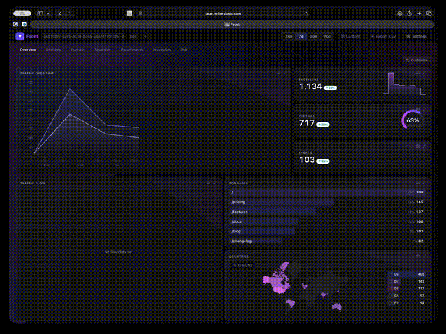

<!-- Facet: privacy-first, Cloudflare-native analytics + experimentation. Project landing README. -->

<!-- Header: title + subtitle at left, logo floated right (theme-aware via GitHub's #gh-*-mode-only). -->


# Facet

### Privacy-first, cookieless web analytics &amp; experimentation

Runs entirely on the Cloudflare edge — no cookies, no external database,<br>
and no cross-session identity to leak.

<br clear="right">

<p align="center">
  <a href="https://deploy.workers.cloudflare.com/?url=https://github.com/writerslogic/facet"></a>
  <a href="https://github.com/writerslogic/facet/actions/workflows/ci.yml"></a>
  <a href="https://scorecard.dev/viewer/?uri=github.com/writerslogic/facet"></a>
  <a href="https://www.bestpractices.dev/projects/14244"></a>
  <a href="https://slsa.dev"></a>
  <a href="https://www.typescriptlang.org"></a>
  <a href="https://workers.cloudflare.com"></a>
  <a href="https://github.com/writerslogic/facet/blob/main/LICENSING.md"></a>
  <a href="https://orcid.org/0009-0003-1849-2963"></a>
</p>

<p align="center">
  <a href="https://writerslogic.github.io/facet/"></a>
</p>

<p align="center">
  <b>The drop-in Umami alternative that's private by <i>math</i>, not policy.</b><br>
  Cookieless, verifiable, and one click on <i>your own</i> Cloudflare account — free tier, no database to run.<br>
  <a href="https://writerslogic.github.io/facet/"><b>Live demo →</b></a> <sub>(no login — fabricated data)</sub>
</p>

Facet is a self-hosted analytics platform that runs 100% on Cloudflare Workers + D1 — no external
database, no long-running server, one `wrangler deploy`. It measures your site by *facet*: pages,
referrers, countries, devices, channels, sessions, goals, funnels, and experiments. It is
**cookieless and GDPR-friendly by construction**: unique visitors are counted with a
daily-rotating, salted `SHA-256` hash, **raw IP addresses are never stored**, and there is no
cross-session identity to leak. The browser client is a drop-in for umami — existing sites migrate
by swapping a single script tag.

Facet is software you run, not a service you sign up for. There is no Facet cloud, no account to
create, and no data of yours held anywhere but your own Cloudflare account.

## Install

Facet deploys to **your** Cloudflare account. You need Node ≥ 22, pnpm 11, and an authenticated
`wrangler`. One command does the rest:

```sh
git clone https://github.com/writerslogic/facet.git
cd facet && pnpm install
npx @writerslogic/facet-cli init
```

`init` creates the D1 database, generates an `ADMIN_TOKEN` and stores it as a Worker secret, applies
migrations, builds the dashboard, deploys, then creates your first site and issues its API key. It
asks only three things — the hostname, the site domain, and the site name — each with a default you
can accept by pressing Enter, and it prints the full plan for confirmation before creating anything.

Re-run it any time: every step detects whether it is already done, so a failed install resumes
rather than duplicating resources. `facet doctor` diagnoses an existing install and is safe to paste
into a bug report. `facet init --dry-run` prints the plan and changes nothing.

Deploying without a custom hostname gives you a `*.workers.dev` URL that works immediately; putting
it on your own hostname is an optional step. No deployment-specific value in this repo points at anyone else's domain, account, or
mailbox — the hostname, the database, the admin token, and the security contact are all yours to
set, and Facet publishes nothing about your deployment that you did not configure. Full walkthrough:
**[docs/install.md](./docs/install.md)**. Manual path, environment variables and operations:
**[docs/self-hosting.md](./docs/self-hosting.md)**.

## What it costs

Facet charges nothing: there is no hosted plan, no per-event pricing, and no seat count. Your only
bill is Cloudflare's, for one Worker and one D1 database. Small and mid-size sites generally fit
inside Cloudflare's free tier; beyond it, the Workers paid plan starts at $5/month at time of
writing. The optional "Ask" tab uses Workers AI, which is metered separately — every other feature
works without it. Check Cloudflare's current [Workers](https://developers.cloudflare.com/workers/platform/pricing/)
and [D1](https://developers.cloudflare.com/d1/platform/pricing/) pricing for the authoritative numbers.

## Why Facet

- **Single deploy.** One Worker serves ingest, the stats API, the dashboard, and cron rollups.
- **No database to run.** State lives in Cloudflare D1; sessions and rollups are materialized by an hourly cron.
- **Cookieless & GDPR-friendly.** Privacy-safe uniques via `SHA-256(ip + user_agent + daily_salt + site_id)`; no cookies, no cross-session identity, no raw IP stored.
- **umami-compatible client.** `window.umami.track(name, props)`, auto-pageviews, SPA navigation, UTM capture, and form-submission tracking work out of the box.
- **Sessions & engagement.** Bounce rate, pages/session, and average visit duration.
- **Traffic channels.** Automatic direct / referral / organic / social / paid / email classification from referrer + UTM.
- **Goals, conversions & funnels.** Define goals and multi-step funnels; get conversion rates and in-order funnel drop-off.
- **A/B experiments & feature flags.** Privacy-first, client-side variant assignment; two-proportion significance testing in the dashboard.
- **Anomaly detection & autopsy.** Automatic z-score detection with a plain-language root-cause summary (largest-contributing segment).
- **Ask in plain English.** Natural-language queries over your stats via Workers AI, translated to a constrained, safe query intent.
- **Realtime.** Active-visitor snapshot over a 5-minute window (distinct daily hashes; no cookies or persistent id).
- **Ad-block-resilient.** First-party `POST /api/event` server-to-server ingest — no client script to block.
- **Explicit visitor opt-out.** A per-visitor opt-out suppresses collection entirely. DNT/GPC disable
  experiments and identity elevation but still allow the anonymous, cookieless pageview; the
  distinction is documented in [the privacy guide](./docs/privacy.md#visitor-opt-out-do-not-track--global-privacy-control).
- **CSV / JSON export.** Export any series or breakdown from the API or dashboard; CSV is spreadsheet formula-injection-safe.
- **In-dashboard admin.** A Settings tab manages sites and API keys, with one-click multi-site switching.
- **Verifiable trust & provenance.** Optional signed statements about the deployment — published keys (`did:web` + JWKS), a W3C VC 2.0 privacy attestation, a RATS build/config evidence EAT, and a SCITT transparency log — with hardware-rootable signing keys. See [`docs/trust.md`](./docs/trust.md).
- **Free, self-issued API keys** and **unlimited, first-class multi-site.**

## How privacy works

The default `anonymous` profile provides the one-day, unlinkable behavior described below. Operators
can deliberately enable longer pseudonymous windows or identified analytics, but those modes require
deployment signing plus explicit, context-bound consent and are disclosed in the deployment's
attestation. The CRM storage contract ships as an opt-in migration for a separate D1 binding. Facet
does not provision or operate that database centrally: each self-hoster decides whether to create,
bind, and migrate its own `CRM_DB`. No analytics bridge exists. See
[Privacy model](./docs/privacy.md); none of these capabilities is equivalent to the default anonymous
profile.

A visitor is identified for **one UTC day only** by `SHA-256(ip ⧊ user_agent ⧊ daily_salt ⧊ site_id)`,
rendered as lowercase hex. The salt rotates at UTC midnight, so the same person produces a different
hash the next day and cross-day re-identification is cryptographically prevented. The raw IP is used
only to compute that hash in memory and is never stored, logged, or returned. See
[`docs/privacy.md`](./docs/privacy.md) for the full model.

## Architecture at a glance

One Cloudflare Worker is the whole backend — ingest, the stats API, the dashboard assets, and the
scheduled rollups all run in it. State lives in D1; there is no server to operate.

```
  browser beacon ─┐                          ┌─ GET /api/stats/*  ──► Dashboard (SPA, served by Worker)
  POST /api/collect├─► Worker ─► privacy hash │
  server events   ─┘   (ingest)   + validate  └─ GET /.well-known/* + /api/attestation/* (signed provenance)
  POST /api/event                    │
                                     ▼
                            D1 (raw events, salts)
                                     │
                     hourly cron ────┤ sessionize · roll up · detect anomalies · purge past retention
                                     ▼
                         D1 (sessions, event_rollups)  ──► fast, aggregate-only reads
```

Ingest hashes and validates in-memory (raw IP never stored), writes raw events to D1, and an hourly
cron folds them into sessions and durable rollups; the stats API and dashboard read only aggregates.

## Packages

| Path | Published as | Purpose |
| --- | --- | --- |
| `apps/server` | — | Cloudflare Worker: ingest + stats API + admin + cron rollups + D1 schema |
| `apps/dashboard` | — | React 19 + Vite dashboard, served as static assets by the Worker |
| `packages/client` | [`@writerslogic/facet`](https://www.npmjs.com/package/@writerslogic/facet) | Browser tracking snippet (zero deps, umami shim) |
| `packages/cli` | [`@writerslogic/facet-cli`](https://www.npmjs.com/package/@writerslogic/facet-cli) (`npx @writerslogic/facet-cli`) | Setup, admin, reporting, offline verification, key generation & selective disclosure CLI |
| `packages/shared` | — | Shared TypeScript types + valibot wire schemas |
| `packages/trust` | — | Workers-native trust & provenance primitives (keys/JWKS, JWS/COSE, VC, DID, MMR, SCITT, RATS) |

## Quick start

**Add tracking to a site** — drop in the standalone script (umami-compatible):

```html
<script defer src="https://your-deployment.example.com/script.js" data-site-id="YOUR_SITE_ID"></script>
```

**Or use it programmatically:**

```sh
npm install @writerslogic/facet
```

```ts
import { init, track, variant } from '@writerslogic/facet';

init({ host: 'https://your-deployment.example.com', siteId: 'YOUR_SITE_ID' });
track('signup', { plan: 'pro' });
const cta = variant('homepage_cta'); // privacy-first A/B assignment
```

**Create a site & API key** (admin, against your deployment):

```sh
curl -X POST https://your-deployment.example.com/api/sites \
  -H "Authorization: Bearer $ADMIN_TOKEN" -H "content-type: application/json" \
  -d '{"name":"My Site","domain":"example.com"}'

curl -X POST https://your-deployment.example.com/api/keys \
  -H "Authorization: Bearer $ADMIN_TOKEN" -H "content-type: application/json" \
  -d '{"site_id":"<the site id from above>"}'
```

**Build & test locally:**

```sh
pnpm install
pnpm typecheck && pnpm lint && pnpm test
```

## Dashboard

The dashboard is a React SPA served by the Worker at the root path. Enter an API key + site id to
view Overview (KPIs, traffic chart, top-lists, channels, realtime), Funnels & conversions,
Experiments, and Anomalies, plus an "Ask" tab for natural-language queries. Custom date ranges with
period-over-period comparison and CSV/JSON export are available throughout. A **Settings** tab
(admin token) manages sites and API keys, with one-click multi-site switching.

## Supply chain & provenance

Every published release carries **two independent, Sigstore-signed provenance attestations** (recorded
in the public Rekor transparency log), so you can verify that an `@writerslogic/*` package was built
from this repo by its GitHub Actions workflow — currently **[SLSA](https://slsa.dev) Build Level 2**:

```sh
# npm provenance (source commit + build workflow)
npm audit signatures

# GitHub build-provenance attestation over the exact tarball
gh attestation verify "$(npm pack @writerslogic/facet-cli --silent)" --repo writerslogic/facet
```

Beyond the packages, a *deployment* signs machine-readable statements about itself (keys, privacy
processing, build/config evidence) — see [Trust & provenance](./docs/trust.md). That cryptographic
layer has extensive conformance/adversarial tests but is not yet independently audited; the standing
[external audit brief](./docs/security-audit-brief.md) makes that status and review scope explicit.
Security policy and reporting: [SECURITY.md](./SECURITY.md).

## Documentation

- [Usage](./docs/usage.md) — the tracking snippet, npm API, UTM & form tracking, umami migration
- [Self-hosting](./docs/self-hosting.md) — one-command deploy on Cloudflare Workers + D1
- [Privacy model](./docs/privacy.md) — the hashing design, salt rotation, and retention
- [Trust & provenance](./docs/trust.md) — signed deployment attestations, verification, hardware-rooted keys
- [Standards & conformance](./docs/standards.md) — the open standards Facet implements, and where
- [API reference](./docs/api.md) — every endpoint, auth, and error code
- [Licensing](./LICENSING.md) — which license covers which package, and the commercial option
- [Trademark & attribution](./TRADEMARK.md) — the name, the logo, and removing "Powered by Facet"
- [CHANGELOG](./CHANGELOG.md) · [Contributing](./CONTRIBUTING.md) · [Security](./SECURITY.md)

## License &amp; attribution

Open source with a commercial option. Facet is written and copyrighted by WritersLogic, Inc.
(© 2026); that is authorship, not a dependency — a Facet you deploy talks to nothing of ours.

**Can you use it?** In short: yes, for free, including commercially, as long as you don't offer a
*modified* Facet to other people as a service without publishing your changes.

| What you're doing | License | What you owe |
| --- | --- | --- |
| Self-hosting Facet for your own sites or organization — including a commercial business | **[AGPL-3.0-only](./LICENSE)** | Nothing. Run it, modify it internally, free forever. |
| Embedding the browser SDK in your site, or using the CLI | **MIT** (`packages/client`, `packages/cli`, `packages/shared`) | Nothing. Your site stays closed-source. |
| Building on the trust/provenance library | **Apache-2.0** (`packages/trust`) | Nothing (includes a patent grant). |
| Offering a **modified** Facet to others as a hosted service | **AGPL-3.0-only** | Publish your modified source under the AGPL — **or** buy a commercial license. |
| Removing the "Powered by Facet" attribution | either | Publish your source per the AGPL, **or** hold a commercial white-label license. |
| Rebranding a fork under the Facet name or logo | — | Not granted by any code license. Use your own name — see **[TRADEMARK.md](./TRADEMARK.md)**. |

The dashboard shows a small **"Powered by Facet"** link. It is a plain, unobfuscated element with no
phone-home and no tamper check: you may remove it by complying with the AGPL (publish your
corresponding source, which the license already requires of a modified network service) **or** under
a commercial white-label license, which sets `VITE_FACET_WHITE_LABEL=1` without the source
obligation. Full terms: **[TRADEMARK.md](./TRADEMARK.md)**.

Commercial licensing (hosted/OEM use without AGPL obligations, white-label, warranty and support):
**[LICENSING.md](./LICENSING.md)** — licensing@writerslogic.com.
